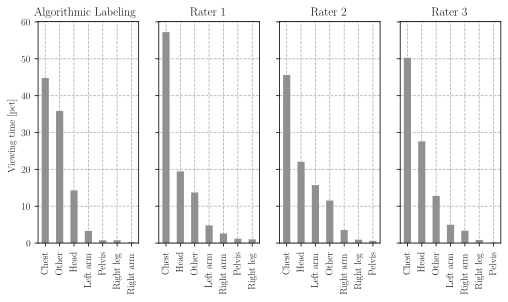
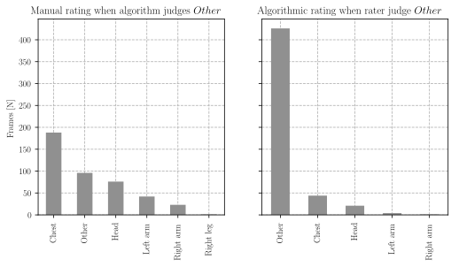
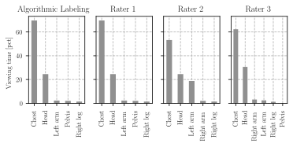
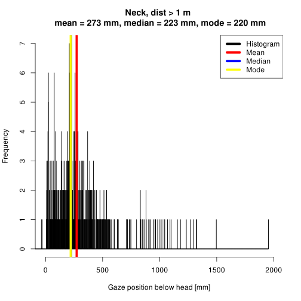
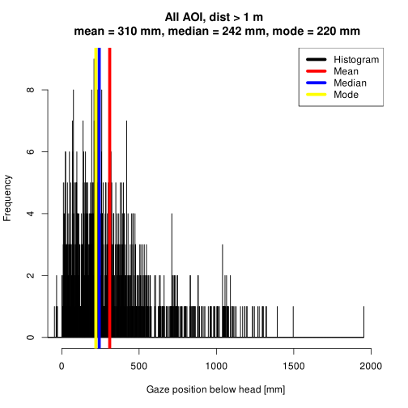
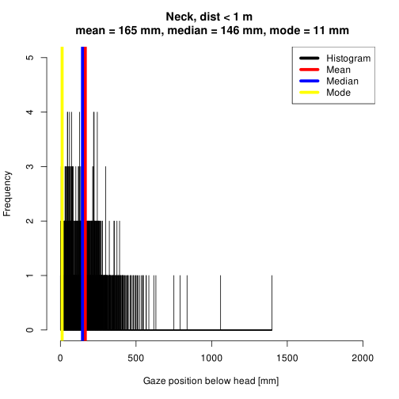
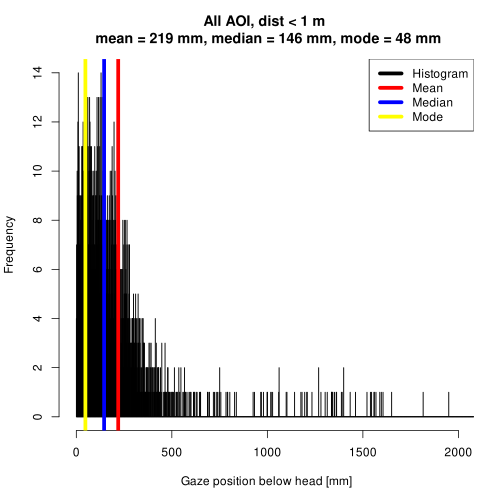

# Algorithmic classification

<!-- https://towardsdatascience.com/inter-rater-agreement-kappas-69cd8b91ff75 -->

<!-- http://john-uebersax.com/stat/agree.htm -->

## Procedure
I used the [online validation](https://share.streamlit.io/footballdaniel/algorithmicvalidation/main/validation.py) to compare the algorithmic classification against three manual raters.
I analyzed the percent viewing time and the inter-rater reliability (Kappa scores).
First, I performed a preliminary analysis where I included all AOI's. It turns out the algorithm is more conservative when the gaze is outsie of the human body. The algorithm judges more frames as `Other`, which leads to a low agreement.

In a second step, I excluded the `Other` category from the analysis and reached a more consistent rater agreement between the algorithm and the manual ratings (on average the manual raters agreed in 79.5% of the frames with the algorithm).

## All AOI
In the first plot you can see the AOI classification for all AOI's (inlucding `Other`!). The classification of the algorithm (left plot) is compared to the classification of the manual raters. 
As you can see, the algorithm has classified many more frames as `Other` (about 35.9%) when compared to the manual raters (about 12.7%).

Why is it that the algorithm classified many more frames as `Other`? It is because the algorithmic classification is really strict when it comes to gaze points that lie outside of the human body (just one pixel away from the human gist is enough). To show this, I looked at all the frames where the algorithm judged `Other` and separately also at all the frames where any human rater judged `Other`

On the left hand, you see that whenever the algorithm judged `Other`, the manual raters did still associate most of the frames to the body. This shows that the algorithm is too conservative and labels frames as `Other` too often.

On the right hand of the plot, I examine all the frames when any of the manual raters judged `Other` and plotted the algorithms judgement against it. Whenever the manual raters classified gaze as `Other`, then the algorithm did so too.

This is a systematic error that leads to a relatively low agreement between the algorithm and the manual raters.

I calculated two dependent variables. First, I calculate the `percent agreement`. This is comparing every manual rater against the algorithm for each frame. I also calculated the `percent agreement` among the manual raters to see for how many frames all manual labels were the same.
Second, I calculated the Cohens Kappa for the comparisons. To also get an idea about the agreement between all three raters, I used Krippendorff's Kappa.

| Comparison all AOI    |   Percent agreement [%] |   Reliability [Cohens Kappa] |
|-----------------------|-------------------------|------------------------------|
| Rater 1 vs. Algorithm |                   59.76 |                         0.39 |
| Rater 2 vs. Algorithm |                   47.73 |                         0.27 |
| Rater 3 vs. Algorithm |                   54.12 |                         0.33 |
| Rater 1 vs. Rater 2   |                   77.86 |                         0.67 |
| Rater 1 vs. Rater 3   |                   80.56 |                         0.70 |
| Rater 2 vs. Rater 3   |                   75.34 |                         0.64 |
| Among manual raters   |                   68.35 |                         0.63 (Krippendorff)|

When we look at all AOI, the agreement between the algorithm and the manual ratings is somewhere between fair and moderate. The agreement among the human raters is substantial.

## When gaze is on body (excluding Other)

Since we are not interested in the `Other` AOI's, I think its fair to also calculate the agreement when we exclude the frames tagged as `Other`. 

Now the judgement of the algorithm and the manual raters are fairly comparable!

| Comparison all AOI    |   Percent agreement [%] |   Reliability [Cohens Kappa] |
|-----------------------|-------------------------|------------------------------|
| Rater 1 vs. Algorithm |                   86.42 |                         0.70 |
| Rater 2 vs. Algorithm |                   71.68 |                         0.50 |
| Rater 3 vs. Algorithm |                   80.64 |                         0.61 |
| Rater 1 vs. Rater 2   |                   79.77 |                         0.64 |
| Rater 1 vs. Rater 3   |                   86.71 |                         0.73 |
| Rater 2 vs. Rater 3   |                   75.00 |                         0.57 |
| Among manual raters   |                   71.82 |                         0.61 (Krippendorff)|

The agreement between the algorithm and the manual raters is on average 79.5% (mean of 86 + 71 + 80). The reliability between the manual raters and the algorithm is now as good as the reliability between the manual raters.

## Gaze anchor at neck

I looked deeper into the estimations of the neck anchor. Generally, we have to be very careful not to over interpret this measure, because we **estimate** the gaze anchor by a **very rough 2D** approximation. Whenever the opponents arms and head were not in a 2D plane (this happens when they are very close), this results in a measurement error. The measure is definitely more trustworthy when the fighers were at a bigger distance from one another.

With this said, I still looked cautiously into the frequency distributions. First, the (more trusthworthy) distributions when the interpersonal distances were > 1 m.
I excluded all the `Other` frames, because we are not interested in the location of the gaze anchor when the judoka is not looking at the opponent.

The anchor is visible clearest when we look at interpersonal distances > 1 m. Here are the plots of the closer fighting distance.

