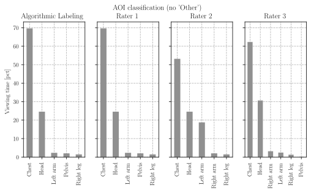
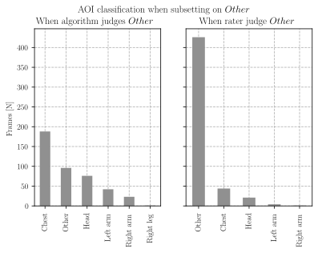
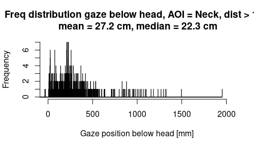
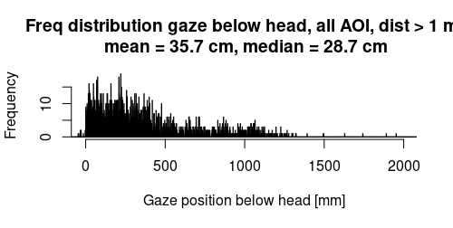

# Algorithmic classification

<!-- https://towardsdatascience.com/inter-rater-agreement-kappas-69cd8b91ff75 -->

<!-- http://john-uebersax.com/stat/agree.htm -->

## Percent viewing time

First I analyze the percent viewing time visually:

There is a general correspondence between the algorithm and the manual ratings. Note that in this plot, I excluded the `Other` category.

I already told you that the Algorithmic classification is really strict when it comes to gaze points that lie outside of the human body (just one pixel is enough). To show this, I looked at all the frames where the algorithm judged `Other` and separately also at all the frames where any human rater judged `Other`

On the left hand, you see that whenever the algorithm judged `Other`, the manual raters did still associate most of the frames to the body. This shows that the algorithm is too conservative and labels frames as `Other` too often.

On the right hand of the plot, I examine all the frames when any of the manual raters judged `Other` and plotted the algorithms judgement against it. Whenever the manual raters classified gaze as `Other`, then the algorithm did so too.

To calculate the reliability between the manual raters and the algorithm, I therefore excluded the `Other` category.

## Inter rater reliability	
I calculated two dependent variables. First, I calculate the `percent agreement`. This is comparing every manual rater against the algorithm for each frame.

| Comparison                  | Percent agreement | Reliability |
| --------------------------- | ----------------- | ----------- |
| Rater 1 vs. Algorithm       | 86.4%             | 0.70 Cohens Kappa |
| Rater 2 vs. Algorithm       | 71.7%             | 0.50 Cohens Kappa |
| Rater 3 vs. Algorithm       | 80.6%             | 0.61 Cohens Kappa |
| Average Rater vs. Algorithm | 79.5% | 0.61 Cohens Kappa (Krippendorff) |

## Gaze anchor at neck

I looked deeper into the estimations of the neck anchor. Generally, we have to be very careful not to over interpret this measure, because we **estimate** the gaze anchor by a **very rough 2D** approximation. Whenever the opponents arms and head were not in a 2D plane (this happens when they are very close), this results in a measurement error.

With this said, I still looked cautiously into the frequency distributions, but this time only looked at interpersonal distances < 1 m. The results are very similar to the numbers I already mentioned in the email.

The anchor is visible clearest when we look at interpersonal distances > 1 m. (For close distances, its just more noisy). You can see some outliers (values > 100 cm below head).

When we look again at interpersonal distances > 1 m but now at all AOI's, gaze is on average roughly 30 cm down from the head.

Again, there is a bunch of measurement error in here. I think there is some general evidence that the gaze is on average about 22 cm (median) or 27 - 35 cm (mean) below the head.

If you want to be conservative, the median value (22.3 cm) makes most sense to me.

